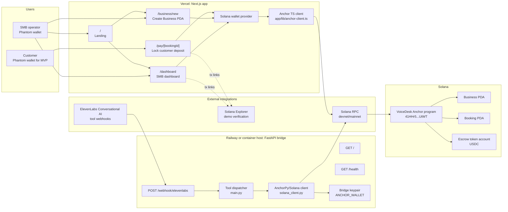
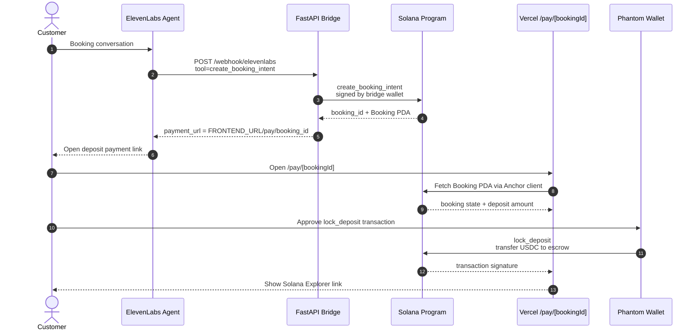
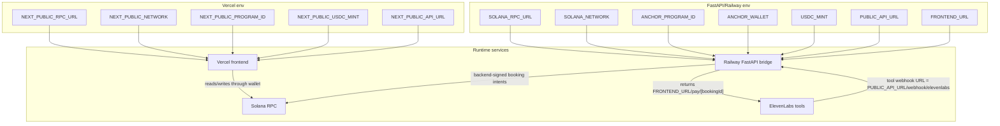

# Architecture Diagrams

Mermaid diagrams for the deployable VoiceDesk MVP: Vercel frontend, FastAPI
bridge, Solana program, wallet signing, and the integrations still required for
the app to work end-to-end.

## MVP Deployment UML

## Booking And Deposit Sequence

## Required Service Wiring

## Integration Checklist

| Integration | Host | Required for MVP | Purpose |
|---|---|---:|---|
| Vercel Next.js app | Vercel | Yes | SMB dashboard, business onboarding, customer deposit payment route |
| FastAPI bridge | Railway/container host | Yes | Receives ElevenLabs tool calls and creates booking intents |
| Solana RPC | Helius/QuickNode/public devnet | Yes | Reads/writes Anchor accounts |
| Phantom wallet | Browser extension | Yes | Signs SMB and customer transactions |
| Anchor program | Solana devnet | Yes | Holds Business/Booking state and USDC escrow logic |
| ElevenLabs Conversational AI | ElevenLabs | Needed for voice demo | Calls FastAPI bridge tools from a Polish voice agent |
| Twilio/SMS | Future | No | Phone/SMS path after browser demo |
| Privy | Future | No | Embedded customer wallet UX |
| Mercuryo | Future | No | Fiat to USDC onramp |
| Supabase/Postgres | Future | No | Analytics, RAG, recordings, GDPR workflows |

